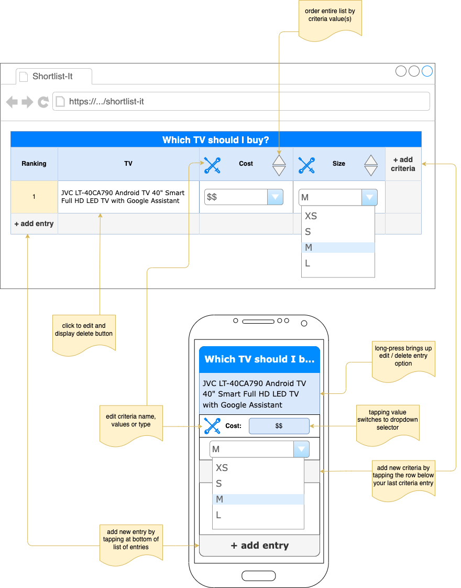

# Shortlist-It
a tool to assist in the decision-making process by adding ranking criteria that can be tracked over time.

## **use case:** determining which television to purchase

### 1) setup the criteria used in the rankings:
> determine which criteria is important to you and create a new `criteria` entry picking a `name`, set of `values` and a `type` _(see [criteria types](#criteria-types) section below for more information on the possible types and their meanings)_

| criteria name | criteria values | criteria type |
|---|---|---|
| cost | `$$$$`, `$$$`, `$$`, `$` | `worst-to-best` |
| size | `XS`, `S`, `M`, `L`, `XL` | `worst-to-best` |
| apps | `0`, `1-5`, `6-10`, `11+` | `worst-to-best` |
| HDMI ports | `0`, `1`, `2`, `3`, `4+` | `worst-to-best` |
| audio ports | `3.5mm`, `RCA`, `optical` | `worst-to-best` (multiselect) |

### 2) then enter the data
> between 4 randomly choosen brands, the data is entered and automatically ranked using the `critera` entered in step 1

| ranking | entry | cost | size | apps | HDMI ports | audio ports |
|---|---|---|---|---|---|---|
| `1` | JVC LT-40CA790 Android TV 40" Smart Full HD LED TV with Google Assistant | `$$` | `M` | `11+` | `3` | `3.5mm`, `optical` |
| `2` | TCL 32RS520K Roku 32" Smart HD Ready LED TV | `$` | `S` | `11+` | `2` | `3.5mm`, `optical` |
| `3` (tie) | LG 28TN515S 28" Smart HD Ready LED TV | `$$` | `XS` | `11+` | `1` | `RCA`, `optical` |
| `3` (tie) | SAMSUNG UE50TU7020KXXU 50" Smart 4K Ultra HD HDR LED TV | `$$$$` | `L` | `11+` | `2` | `optical` |

### 3) use the ranking to determine actions
> in the above example, the **JVC 40" TV** has the highest ranking based on your defined criteria 

> NOTE: each television has many more criteria that could have been used, but if a user doesn't care about those other options they just are noise that makes it difficult to choose so only enter the values that are important to you and you'll easily be able to choose a winner

----

## **use case:** determine which friends to invest your time in
### 1) setup the criteria used in the rankings:
> determine which criteria is important to you and create a new `criteria` entry picking a `name`, set of `values` and a `type` _(see [criteria types](#criteria-types) section below for more information on the possible types and their meanings)_

| criteria name | criteria values | criteria type |
|---|---|---|
| giver or taker | `taker`, `both`, `giver` | `worst-to-best` |
| feeling when with them | `anger`, `agitation`, `sadness`, `nothingness`, `warmth`, `joy`, `elation` | `worst-to-best` |
| activity level | `none`, `extreme`, `low`, `moderate` | `worst-to-best` |
| makes me a better person | `true`, `false` | `boolean` |
| good features | `tidy`, `fashionable`, `kind`, `athletic`, `attractive`, `intelligent` | `positives` |

### 2) then enter the data
> enter each friend's data and they will be automatically ranked based on the `critera` entered in step 1

| ranking | entry | giver or taker | feeling when with them | activity level | makes me a better person | good features |
|---|---|---|---|---|---|---|
| 1 | Mark | `giver` | `joy` | `moderate` | `false` | `kind`, `athletic`, `intelligent` |
| 2 | Carl | `giver` | `joy` | `low` | `true` | `kind`, `intelligent` |
| 3 | Sophie | `both` | `warmth` | `low` | `false` | `tidy`, `attractive` |
| 4 | Roger | `taker` | `nothingness` | `moderate` | `true` | `athletic`, `intelligent` |

### 3) use the ranking to determine actions
> in the above example, both **Mark** and **Carl** should get the most time, attention and effort

> NOTE: each relationship has many more criteria that could have been used, but if a user doesn't care about those other options they just are noise that makes it difficult to choose so only enter the values that are important to you and you'll easily be able to choose a winner

----

# Criteria
each `criteria` contains a unique free-form name and values which are used to allocate points to a given `entry` for the category defined by the `criteria`. any `criteria` can be added either before any entries exist or after and adding them `after` will leave the values as `undefined` for all existing entries until specifically assigned.

## Criteria Types
the following types can be used when adding `criteria` used in the rankings:
| type | description |
|---|---|
| `worst-to-best` | a list where more points are given to items at the end of the list and less to items at the beginning. there is also the option to allow `multi-select` of the items in the list and if this is enabled, the points are still assigned the same way, but multiple selections are added together to get the final score for this `criteria` |
| `boolean` | either the criteria is `true` and a point is awarded or `false` and no point is awarded |
| `positives` | a `multi-select` list where each item selected awards only 1 point and the overall value for this `criteria` is determined by the sum of values selected |
| `negatives` | a `multi-select` list where each item selected subtracts 1 point and the overall value for this `criteria` is determined by the sum of values selected as a negative number applied to the overall total |

## Criteria Data Structure
```ts
type CriteriaType = 'worst-to-best' | 'boolean' | 'positives' | 'negatives';
type Criteria = {
    name: string;
    type: CriteriaType;
    values?: Array<string>;
    multiple?: boolean; // allow selection of multiple values
};

// example: worst-to-best
const size: Criteria = {
    name: 'size',
    type: 'worst-to-best',
    values: ['XS', 'S', 'M', 'L', 'XL']
};

// example: worst-to-best multiselect
const audioPorts: Criteria = {
    name: 'audio ports',
    type: 'worst-to-best',
    values: ['3.5mm', 'RCA', 'optical'],
    multiple: true
};

// example: boolean
const betterPerson: Criteria = {
    name: 'makes me a better person',
    type: 'boolean'
}
```

----

# Entries
each `entry` must contain a unique free-form name / description that is used to differentiate it from other entries. an `entry` can be created before any `criteria` or after `criteria` have been defined. when creating an `entry` where `criteria` already exist, you will be able to add values for the `entry` immediately and any `criteria` left unset will have a value of `undefined`.

## Entry Data Structure
```ts
type Entry = {
    description: string;
    values: Map<string, string | Array<string>>
};

// example: fully defined
const jvcLt: Entry = {
    description: 'JVC LT-40CA790 Android TV 40" Smart Full HD LED TV with Google Assistant',
    values: new Map([
        ['cost', '$$'],
        ['size', 'M'],
        ['apps', '11+'],
        ['HDMI ports', '3'],
        ['audio ports', ['3.5mm', 'optical']]
    ])
};

// example: partially defined
const tcl: Entry = {
    description: 'TCL 32RS520K Roku 32" Smart HD Ready LED TV',
    values: new Map([
        ['cost', undefined],
        ['size', 'S'],
        ['apps', '11+'],
        ['HDMI ports', undefined],
        ['audio ports', undefined]
    ])
};
```

# UX Mockups
## Interactions and Layout


# Future Ideas
- multiple list tracking
- historical tracking and future trends prediction
- export / import data
- integration with external applications